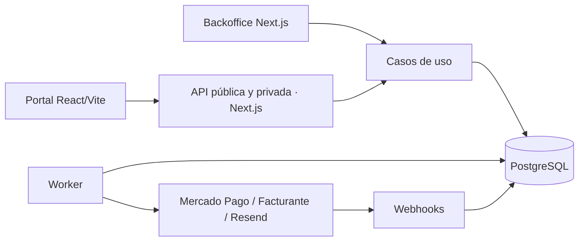

# Arquitectura y dominio propuestos

Estado: propuesta técnica para revisión, sujeta a las decisiones de `04-decisiones.md`. No se generará el esquema Prisma definitivo hasta cerrar propiedad de datos, cobro, políticas y reglas de liquidación.

## Organización técnica

Monolito modular con dos aplicaciones visuales y un worker. Un monorepo facilita cambios coordinados de contratos y un único equipo; cada aplicación conserva build, dominio y despliegue propios. No hace falta separar repositorios para separar experiencia visual o despliegues.

```text
NailNet/
  apps/
    backoffice/           Next.js App Router, UI administrativa y rutas API
    booking/              React/Vite, portal público responsive
    worker/               Node/TypeScript, trabajos durables
  packages/
    domain/               reglas puras y casos de uso del backend
    database/             Prisma, migraciones y repositorios
    integrations/         Mercado Pago, Facturante, Resend (solo servidor)
    contracts/            DTO y validación de entrada/salida, sin Prisma
    config/               TypeScript, lint y convenciones
  docs/
  tests/                  integración PostgreSQL, contratos y E2E
```

El portal importa únicamente contratos y utilidades públicas. Ningún paquete de persistencia, credencial o lógica confiable se incluye en su bundle. Backoffice y worker comparten casos de uso; routes y Server Actions son adaptadores delgados.

React/Vite se propone por el flujo transaccional acotado y la referencia ya disponible. Next.js separado sería preferible si el portal necesita páginas indexables por sede/servicio y SEO como requisito de lanzamiento. No se presupone ese alcance. Las versiones se fijarán con lockfile y compatibilidad verificada durante el scaffold.



## Límites de módulos

Identidad y acceso; organización y sedes; clientes y consentimientos; catálogo; profesionales; agenda y recursos; reservas; pagos; ventas y caja; inventario y gastos; facturación; comisiones y franquicias; reportes; notificaciones. Cada módulo expone casos de uso y evita escribir directamente las tablas de otro salvo mediante coordinación transaccional explícita.

## Modelo relacional propuesto

Todas las entidades de negocio pertenecen a una organización. Usar IDs opacos, fechas de creación/actualización y desactivación en catálogos. Historial financiero por reversos, sin borrados. Relaciones compuestas o validaciones transaccionales aseguran que una FK no enlace organizaciones o sedes incompatibles.

| Agregado | Entidades y cardinalidad | Datos/reglas principales |
|---|---|---|
| Organización | Organizacion 1:N Franquiciado; Franquiciado 1:N Sede | Cada sede tiene exactamente un franquiciado; propietario comercial independiente del login |
| Identidad | Usuario, MembresiaOrganizacion, Rol, Permiso, RolPermiso, AsignacionRol, UsuarioSede | Asignación explícita a organización, franquiciado, sede o propio usuario; varias asignaciones por usuario |
| Cliente | Cliente, ClienteSede, ClienteConsentimiento, ConsentimientoVersion | Contacto, sexo opcional, observaciones estéticas, datos fiscales opcionales; usuario opcional. Compartición de historial pendiente |
| Catálogo | CategoriaServicio, Servicio, ServicioSede, ServicioSkill | ServicioSede único por sede/servicio; precio y duración efectiva, política de seña; requiere todas las skills configuradas |
| Consentimiento | ServicioConsentimiento -> ConsentimientoVersion; ClienteConsentimiento -> cliente/reserva/version | Texto/version aceptada, fecha, evidencia y canal; separado de términos generales |
| Profesional | Profesional, ProfesionalSede, Skill, ProfesionalSkill, ProfesionalServicio | Usuario opcional; habilitación expresa del servicio además de skills y sede |
| Calendario | HorarioSede, HorarioProfesional, ExcepcionHorario, Feriado, BloqueoAgenda | Reglas semanales locales, vigencia, pausas y excepciones por fecha; bloqueos de profesional globales entre sedes |
| Recursos | TipoRecurso, Recurso, ServicioRequisitoRecurso | Cabina/sala/máquina/espacio como unidades individuales. Cada requisito pide cantidad por tipo o unidad específica |
| Reserva | Reserva, ReservaRecurso, OcupacionAgenda, ReservaEvento | Un servicio y un profesional por turno MVP; inicio/fin, canal, cliente, sede, expiresAt, snapshots de precio/duración/políticas |
| Cobros | Pago, IntentoPago, PagoMercadoPago, AplicacionPago, Reembolso | Pago independiente de suscripciones; intentos rechazados no cambian otros pagos aprobados. Aplicación vincula venta y anticipo de reserva |
| Operación MP | CuentaMercadoPago, EventoProveedor | Cuenta propia de cada sede, sin asignación compartida entre sedes; configuración por ambiente; ID externo único por proveedor/cuenta/ambiente; secretos cifrados |
| Venta | Venta, VentaItem | Ítem SERVICIO o PRODUCTO con FK correspondiente y snapshot; profesional/reserva para servicio. Múltiples medios de pago vía Pago |
| Caja | Caja, SesionCaja, MovimientoCaja, CierreCaja, MedioPago | Una sesión abierta por caja, saldo inicial, movimientos inmutables, esperado/contado/diferencia. Digitales separados del efectivo físico |
| Inventario | CategoriaProducto, Producto, ProductoSede, StockSede, MovimientoStock, Compra, CompraItem | SKU y unidad; Decimal para consumibles; precio por sede; movimientos por compra/venta/consumo/ajuste/reverso |
| Gastos | CategoriaGasto, Gasto, GastoPago | Devengamiento separado de egreso real; asociación con caja y sede |
| Comisiones | ReglaComision, DevengamientoComision, LiquidacionProfesional, LiquidacionProfesionalItem | Vigencia, base/porcentaje congelados por servicio; única devengación por ítem y regla; ajustes posteriores explícitos |
| Franquicia | ContratoFranquicia, ReglaCargoFranquicia, LiquidacionFranquicia, LiquidacionFranquiciaItem | Tipos ROYALTY, CANON, FONDO_PUBLICIDAD; fijo/porcentaje, base, vigencia y periodicidad; reemplaza tres motores separados |
| Facturación | EmisorFiscal, FacturanteConfig, Comprobante, ComprobanteItem, ComprobanteAplicacion | EmisorFiscal/CUIT compartible entre sedes de la organización; configuración y credenciales propias por sede, puntos de venta distintos por emisor y ambiente; aplicaciones a venta/cobro según política; notas de crédito relacionadas al original |
| Fiabilidad | OutboxEvent, Job, ClaveIdempotencia, Notificacion, AuditLog | Reintentos, leases, correlación, deduplicación y trazabilidad mínima de cobros/permisos/cancelaciones |

No es necesario crear tablas independientes ReservaPago y AplicacionPago que dupliquen el mismo vínculo: AplicacionPago expresa monto y destino. Cuando la venta final nace de una reserva, transfiere/referencia la imputación de la seña sin registrar un segundo ingreso.

Importes ARS con Decimal de escala 2 y redondeo explícito; cantidades de stock Decimal con unidad fija por SKU. No usar Number para cálculos monetarios del dominio. El DTO transmite importes como cadenas decimales. Precio, descuento, impuestos, base de comisión y políticas quedan congelados en el hecho original.

Índices/constraints mínimos: `(sedeId, servicioId)`, `(sedeId, productoId)`, claves de proveedor, idempotencia con hash de solicitud, ítem de liquidación de origen y períodos; `fin > inicio`, cantidad positiva y saldos de stock no negativos. Índices de agenda por profesional/tiempo y recurso/tiempo, y reportes por sede/fecha/estado.

## Autorización

| Rol | Alcance propuesto |
|---|---|
| MASTER_FRANQUICIADOR | Toda la organización, configuración global y consolidado |
| FRANQUICIADO | Sus sedes, usuarios, reportes y administración autorizada |
| ADMIN_SEDE | Sedes asignadas, operación y configuración local permitida |
| RECEPCIONISTA | Clientes, reservas, cobros y caja de sedes asignadas; reembolso según permiso explícito |
| PROFESIONAL | Agenda y servicios propios; datos mínimos del cliente necesarios para atender |

Toda consulta, mutación y exportación aplica permiso + organización + alcance. El ID enviado por el navegador nunca concede acceso. El selector de sede solo filtra dentro del alcance; un filtro inválido debe rechazarse, no ampliar resultados. Credenciales y asignaciones de permisos tienen permisos distintos a los de operación. Revocación/usuario inactivo se comprueba en servidor y se invalida la sesión.

Confirmado el 2026-09-10 (D13): por ahora Cliente se comparte entre franquiciados de la misma organización, sin propietario franquiciado. ClienteSede registra el vínculo con las sedes sin duplicar la identidad por franquiciado. No se comparten clientes entre organizaciones. El usuario todavía no definió la visibilidad del historial: se mantiene como propuesta restringir visitas, pagos y observaciones a las sedes autorizadas. Compartir identidad no concede automáticamente permisos de edición ni acceso al historial completo.

## Disponibilidad y exclusión concurrente

1. Resolver ServicioSede habilitado y sus snapshots de duración, precio, buffers y requisitos.
2. Intersectar apertura de sede, jornada del profesional en esa sede, excepciones/feriados y anticipación permitida.
3. Filtrar profesionales activos por todas las skills, habilitación del servicio, asignación y ausencia de bloqueos.
4. Descontar ocupaciones activas y retenciones vigentes del profesional en TODAS las sedes, más buffers configurados.
5. Encontrar un conjunto simultáneo de recursos distintos que satisfaga todos los requisitos durante el intervalo completo. Un recurso no puede cubrir dos requisitos simultáneos por accidente.
6. Para «cualquiera», ordenar candidatos de forma determinista, por ejemplo menor carga del día y luego ID. Asignar uno concreto dentro de la transacción y devolverlo al cliente.

Persistir timestamps UTC y timezone IANA `America/Argentina/Buenos_Aires` por sede. Generar horarios desde calendario local. Intervalos semiabiertos `[inicio, fin)`: turnos contiguos son válidos si sus buffers lo permiten. Una reserva MVP no combina múltiples servicios ni profesionales.

Estrategia inicial sin extensiones: filas de bloqueo persistentes por profesional y recurso, bloqueadas `FOR UPDATE` en orden estable. Bajo esos locks, expirar retenciones vencidas, releer configuración/calendario y verificar solapamientos antes de insertar reserva y ocupaciones en una sola transacción. Todas las vías de escritura, incluidas ausencias, reprogramaciones y vencimientos, usan el mismo protocolo. No basta con bloquear reservas existentes: puede no existir ninguna fila en el horario disputado.

El lock del profesional es global entre sedes. Cambios de calendario/configuración deben coordinarse con los mismos locks o versiones comprobadas, y rechazar conflictos con reservas vigentes. Reintentar deadlocks de forma acotada. La estrategia se apoya en los locks transaccionales de [PostgreSQL](https://www.postgresql.org/docs/current/explicit-locking.html); requiere pruebas reales con conexiones simultáneas. Una exclusión de rangos en PostgreSQL puede añadirse como segunda defensa tras validar migraciones y extensiones disponibles.

## Estados y políticas

Reserva: PENDIENTE_PAGO -> PAGO_EN_REVISION o CONFIRMADA; ambas pendientes pueden pasar a EXPIRADA o CANCELADA. CONFIRMADA -> ATENDIDA, AUSENTE o CANCELADA. Reprogramar genera evento y conserva historial; una sustitución enlaza la reserva original y la nueva de forma atómica. No borrar un turno para moverlo.

Pago: PENDIENTE, APROBADO, RECHAZADO, CANCELADO, REEMBOLSADO_PARCIAL, REEMBOLSADO, EN_DISPUTA. Reembolso: SOLICITADO, APROBADO_PARA_EJECUTAR, EN_PROCESO, COMPLETADO, FALLIDO o RESULTADO_DESCONOCIDO. La reserva no pasa a REEMBOLSADA: ese atributo es financiero, compatible con cancelación o atención. La UI puede mostrar ambos estados.

Se propone retención de 15 minutos sin extensión automática por reintentos; valor pendiente de aceptación. PAGO_EN_REVISION no retiene indefinidamente. Un rechazo permite nuevo intento solo si la retención sigue vigente. El worker libera vencimientos y cada intento de ocupar limpia expirados bajo lock; el cron no es la única garantía.

Si llega una aprobación después de expirar o cancelar, registrar el pago real y abrir incidencia de devolución; no recuperar un horario ya liberado ni confirmar silenciosamente. Cobro duplicado: registrar cada transacción externa una vez, imputar hasta el saldo y enviar excedente a revisión/reembolso. Un evento antiguo no degrada una aprobación: releer estado actual del proveedor y aplicar transición válida bajo lock.

La recepción usa el mismo motor y, mientras no se acuerde excepción, el mismo requisito de seña MP. Cancelar libera ocupación aunque el reembolso esté pendiente. Cambios de precio o política no alteran reservas anteriores.

## API y pagos

Contrato público versionado: `GET /api/public/v1/sedes`, servicios por sede, profesionales compatibles, disponibilidad; `POST /api/public/v1/reservas` con Idempotency-Key; checkout ligado a una reserva; consulta de estado mediante token opaco. Acciones de gestión de invitado exigen token de propósito acotado, guardado hasheado, vencimiento y revocación. No devolver el historial por email/teléfono sin verificación.

La creación recalcula precios y disponibilidad; devuelve 409 por conflicto, 422 por entrada inválida y 429 por abuso. Reutilizar clave con otro payload devuelve conflicto. La API privada usa sesión y protección CSRF/origin; CORS público se limita al portal, pero no reemplaza autorización. Límites durables de intentos evitan acaparar turnos con retenciones.

Checkout Pro con redirección es la propuesta inicial. Persistir intención local antes de llamar a MP; correlacionar cuenta, reserva, intento y referencia. No mantener una transacción SQL abierta durante HTTP. Un fallo de checkout conserva una intención reconciliable, sin duplicar reserva.

Webhooks: validar firma con secreto del ambiente, persistir evento antes de responder éxito, consultar pago en MP y validar cuenta receptora, referencia, moneda y monto esperado. Confirmación, aplicación del anticipo y outbox se escriben atómicamente. La URL de retorno solo inicia consulta al backend. Seguir la [documentación oficial de notificaciones de Checkout Pro](https://www.mercadopago.com.ar/developers/es/docs/checkout-pro-preferences/payment-notifications).

Cada operación financiera tiene clave local estable y utiliza idempotencia del proveedor cuando el endpoint la soporte. Deduplicar efectos además de entregas del webhook: una transacción puede tener múltiples actualizaciones legítimas. Reconciliación periódica recupera callbacks perdidos y resultados desconocidos.

## Venta, caja, stock y liquidaciones

Ejemplo: servicio de $30.000 con seña $9.000; al atender se genera venta de $30.000 y se aplica el anticipo, dejando $21.000 por cobrar. El reporte de ventas suma $30.000; el de cobros suma $9.000 + $21.000. No sumar $39.000 ni crear otro ingreso por aplicar la seña.

La venta puede agregar productos. Registrar venta, salida de stock y cobros presenciales coherentemente; restar stock con condición `cantidadDisponible >= solicitada`. Un reembolso no repone productos sin devolución física explícita. Consumo interno genera salida y costo, sin ingreso comercial.

Cierre de caja: apertura + entradas efectivo - salidas efectivo = esperado; contado - esperado = diferencia. MP, tarjetas y transferencias tienen totales por medio separados del arqueo físico. Cierre inmutable y correcciones mediante movimientos identificados.

Propuesta de comisión pendiente: devengar una vez sobre ítem de servicio atendido y completamente cobrado, después de descuentos, excluyendo productos/propinas. Reembolsos posteriores generan ajustes; una liquidación cerrada no se recalcula silenciosamente. Base impositiva y periodicidad requieren respuesta.

Royalties, canon y fondo usan reglas versionadas y liquidaciones por período. Cada ítem conserva regla, base y hechos incluidos; nueva ejecución del mismo período no duplica cargos. No realizar débitos automáticos ni split de pagos como parte del MVP.

## Facturante y trabajos durables

D8 confirmado: cada sede tiene cuentas independientes para los proveedores. La identidad fiscal se separa de esa configuración: varias sedes pueden referenciar el mismo CUIT, pero con puntos de venta diferentes. EmisorFiscal será único por organización/CUIT; la asignación de emisor/punto de venta/ambiente será exclusiva de una sede. Compartir emisor no amplía permisos ni mezcla cobros. Los comprobantes conservan sede, emisor y punto de venta del momento de emisión; cambiar configuración no reescribe el historial. D9 (momento de emisión y anticipos) sigue pendiente.

Facturante sigue siendo el emisor externo. La política de cuándo facturar y cómo aplicar anticipos se cerrará con el responsable contable del negocio; no se deduce de Clicnet ni de fuentes europeas del prompt.

Crear Comprobante/Job local con clave única y snapshot antes de emitir; worker obtiene lease y pasa a EN_PROCESO. Persistir respuesta e identificación externa. Ante timeout después del envío, marcar RESULTADO_DESCONOCIDO y consultar/reconciliar antes de repetir. No prometer exactamente una emisión externa si el proveedor no permite deduplicar o consultar por referencia; en ese caso revisión manual obligatoria de resultados ambiguos.

Permitir varias notas de crédito parciales con claves propias, vínculo al original y control del saldo acreditable; no copiar la unicidad `(pagoId, tipo)` para todo el circuito. Reembolso MP y nota de crédito son operaciones relacionadas pero independientes.

Outbox/Job en PostgreSQL con estado, próximo intento, intentos, lease con vencimiento y último error. Worker reintenta con espera creciente y deriva agotados a revisión. Emails de confirmación, cancelación, reprogramación, pago/reembolso y recuperación tienen clave de evento; caída del proceso no debe perderlos. Auditoría mínima registra actor, acción, entidad, fecha y correlación sin secretos ni payloads indiscriminados.

## Despliegue y operación

Propuesta Railway: servicios backoffice, booking, worker y PostgreSQL, ambientes staging/production con credenciales separadas. Un build/start por aplicación y watch paths que incluyan sus paquetes compartidos permiten deploys independientes en el [monorepo de Railway](https://docs.railway.com/deployments/monorepo).

Solo backend/worker acceden a DATABASE_URL. Variables server-only: sesión, cifrado versionado, OAuth/secret de webhook MP, Facturante por ambiente y Resend. Portal: URL pública de API. Datos de cuentas por sede cifrados en DB, claves fuera de DB. No se provisionó ningún servicio en esta etapa.

Migraciones ejecutadas una vez por release, compatibles con despliegue gradual de API/worker/portal. Backups y restauración ensayada antes del piloto; health checks, alertas por jobs vencidos, pagos sin imputación y comprobantes ambiguos. Logs con correlation ID y datos personales reducidos. Rollback de aplicación debe ser compatible con esquema vigente; evitar rollback destructivo automático de migraciones.

## Reportes y definiciones

Ventas por fecha de venta/atención; cobros por fecha de pago, con reembolsos separados. Desgloses sede/servicio/profesional/medio, comparación entre sedes y consolidado por franquiciado/master. Ticket promedio = ventas completadas netas de descuentos / cantidad de ventas completadas (reversiones explícitas). Clientes nuevos/recurrentes según primera atención dentro del alcance consultado. Ocupación = minutos confirmados/atendidos sobre minutos laborables netos de bloqueos; retenciones pendientes se muestran aparte. Cancelaciones y ausencias incluyen denominador y período visible.

CSV inicial satisface la exportación CSV o Excel del pedido; mismo alcance de autorización que la pantalla y neutralización de celdas que puedan ejecutarse como fórmulas. Comisiones/cargos muestran base y versión; caja, gastos y stock tienen movimientos trazables.
