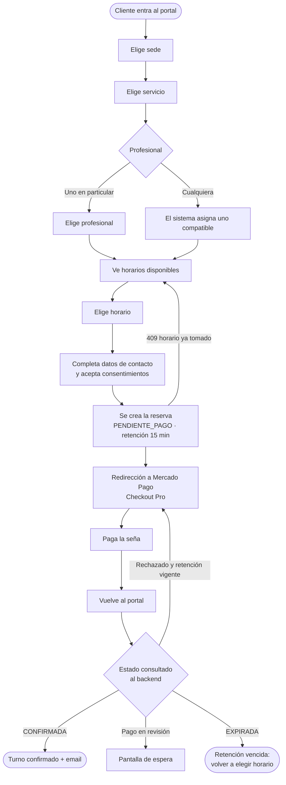
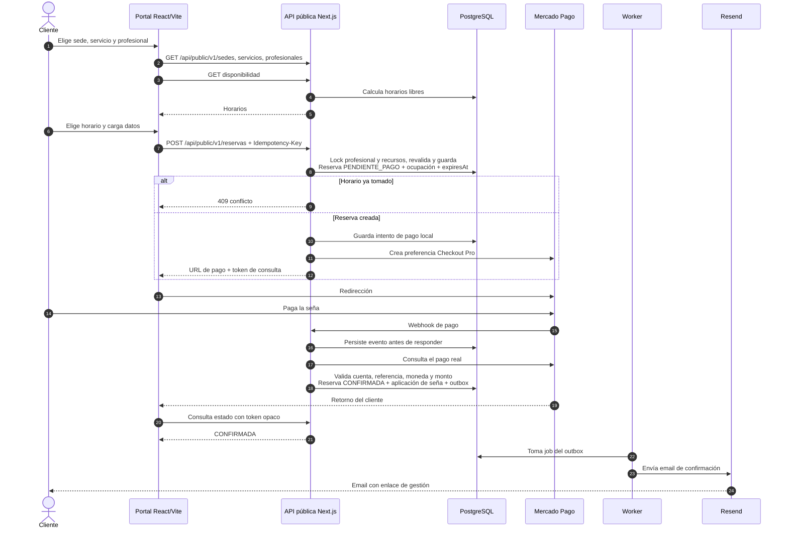
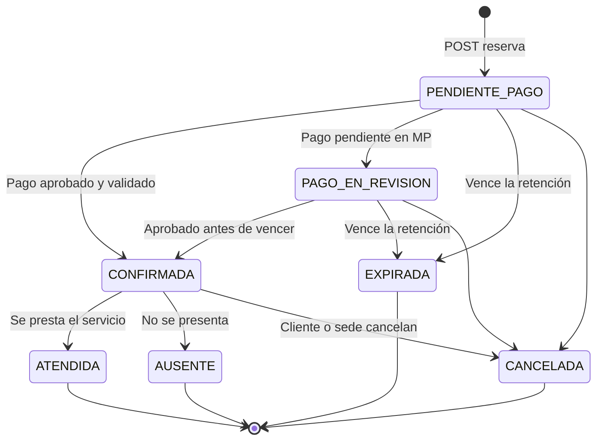
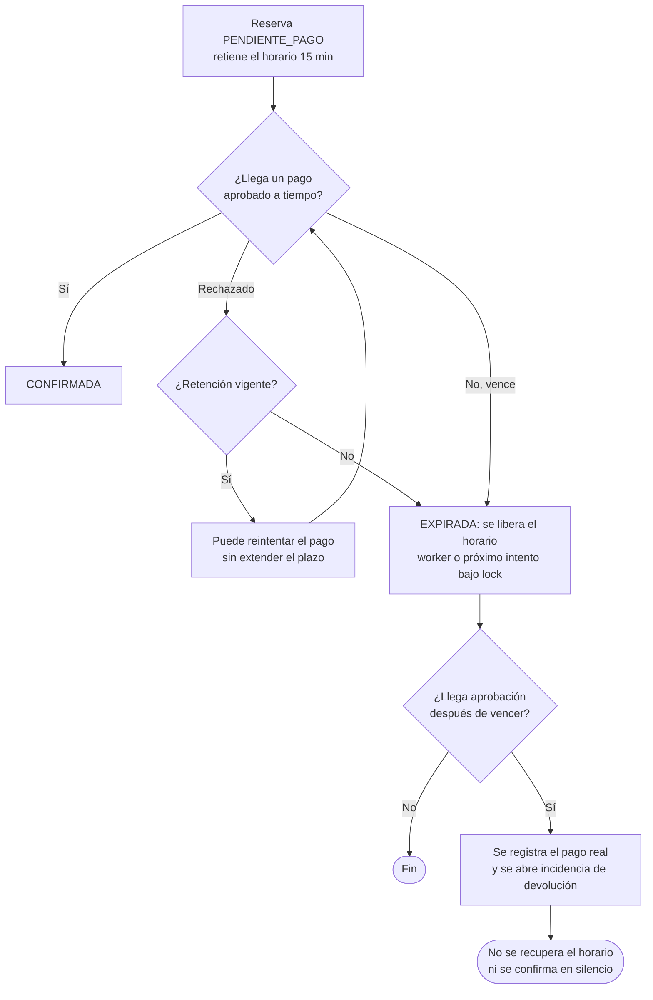
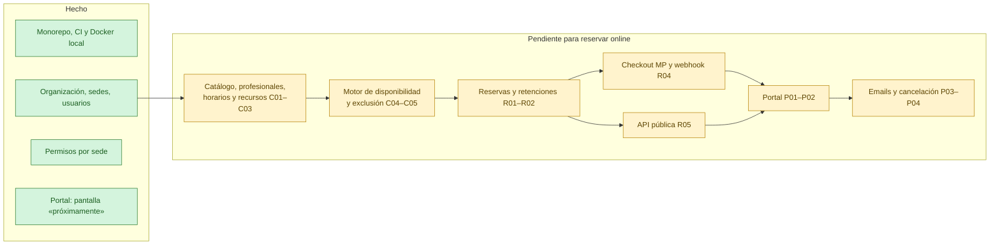

# Flujo de reserva web del cliente · 25 de septiembre de 2026

Diagramas preparados para revisar el estado del proyecto. Muestran el **flujo propuesto**, tomado de [02-arquitectura.md](02-arquitectura.md), [03-backlog.md](03-backlog.md) (P01–P04, R01–R05) y [04-decisiones.md](04-decisiones.md). Hoy **no está implementado**: el portal (`apps/booking`) solo muestra «Reservas online próximamente» y no existen endpoints públicos, reservas, pagos ni emails. Los valores marcados como pendientes dependen de decisiones abiertas.

## 1. Recorrido del cliente en el portal

Pasos definidos en P01: sede → servicio → profesional → horario → datos → seña → confirmación. El cliente reserva como invitado (propuesta D2).

La vuelta desde Mercado Pago **no confirma** la reserva: solo dispara una consulta. Quien confirma es el webhook validado (sección 2).

## 2. Secuencia técnica: reserva, pago y confirmación

## 3. Estados de la reserva

El reembolso no es un estado de la reserva: es un estado del pago. Reprogramar crea una reserva nueva enlazada a la original, sin borrar el turno.

## 4. Retención, vencimiento y pago tardío

## 5. Estado de implementación

## Decisiones abiertas que afectan este flujo

| ID | Tema | Impacto en el flujo |
|---|---|---|
| D2 | Cuenta del cliente | Propuesta: invitado con enlace por email; cuenta opcional después |
| D3 | Tipo e importe de seña | Monto que se cobra en Checkout Pro |
| D4 | Retención | 15 minutos propuestos; define cuándo expira |
| D5 | Cancelación y reprogramación | Anticipación mínima y devolución desde el enlace del email |
| D7 | Reembolsos | Circuito para pagos tardíos y cancelaciones |
